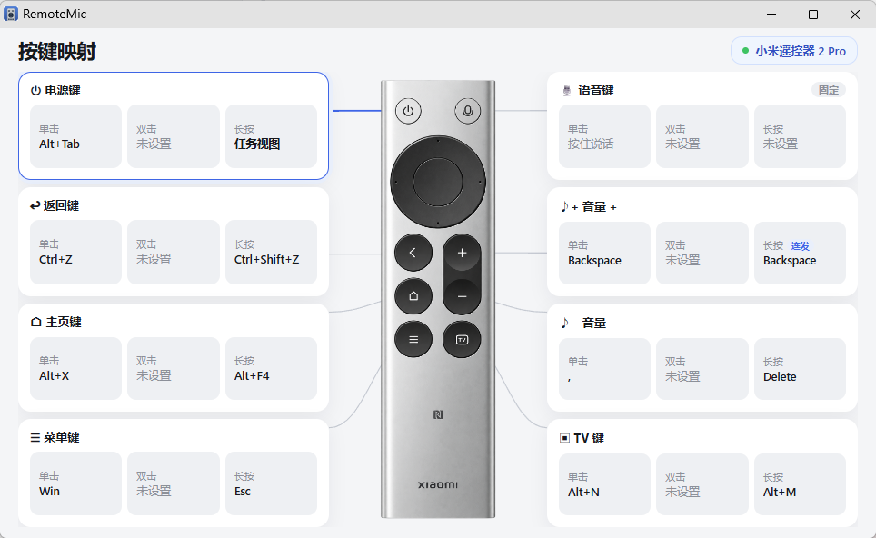

# RemoteMapper（免驱动版）

把小米蓝牙语音遥控器变成 Windows 的**语音输入话筒**和**可编程遥控器**。

按住遥控器语音键 → 微信输入法语音录入自动弹出，遥控器麦克风的声音实时送进去；松开 → 结束录入并恢复原来的默认麦克风。其余按键可以在可视化面板里改成任意快捷键。

**这个分支不需要安装任何驱动**，也不用开测试签名：解压、双击、能用。需要完整按键（返回、音量 ±）和按键来源隔离的话，用 [`main`](../../tree/main) 分支。

---

## 能做什么

- **语音直通** —— 解码蓝牙 BLE ATVV 协议里的 IMA ADPCM 音频，经 VB-Cable 实时送进输入法，延迟无感
- **用完即还** —— 只在按住语音键期间临时切换默认录音设备，松开立刻恢复，平时开会录音不受影响
- **可视化按键映射** —— 托盘双击打开映射面板，单击 / 双击 / 长按 / 连发四种手势，保存即热加载
- **动作不止快捷键** —— 组合键、任务视图、启动程序、执行命令，甚至跑一段 C# 表达式把结果输入到光标处
- **换输入法也能用** —— 语音热键可配，填谁的快捷键就唤起谁

---

## 快速开始

1. **装 [VB-Audio Virtual Cable](https://vb-audio.com/Cable/)**（免费），装完系统会多出 `CABLE Input` / `CABLE Output` 一对虚拟设备，不用手动改默认录音设备。
2. **装 [微信输入法](https://z.weixin.qq.com/)**，在设置里开启语音输入的「按住说话」，并把它的快捷键设成和程序的语音热键一致（如 `右 Alt + 逗号`）。
3. **配对遥控器**：设置 → 蓝牙 → 添加「小米蓝牙语音遥控器」。配对后它同时是 BLE 设备（语音）和 HID 键盘（按键）。
4. **双击 `start.vbs`** 后台常驻，日志写进 `RemoteMic.log`；想看实时输出就用 `debug.bat`。

要把它交付到别人的电脑上，见 [`DEPLOY.md`](DEPLOY.md)。

看到这几行就绪即可使用：

```text
== RemoteMic: remote mic -> CABLE + WeChat IME hotkey ==
[1/4] connecting to remote... OK (MI RC)
[2/4] setting up ATVV service... OK
[3/4] opening VB-Cable Input... OK
[KEYMAP] voice hotkey: RALT+OEM_COMMA
[4/4] ATVV handshake... ready
>> HOLD the voice button to talk. Release to stop.
```

把光标点进任意文本框，按住语音键说话，松开结束。

退出：托盘图标右键「退出」，或双击 `stop.bat`。开机自启：`install-autostart.bat`（卸载用 `uninstall-autostart.bat`）。

---

## 按键映射

双击托盘图标打开映射面板，点按键卡片改单击 / 双击 / 长按的动作，保存后写回 `keymap.json` 并立即生效。



免驱动模式下的两点取舍：

- **返回、音量 ±** 走的是 HID Keyboard Page 的 `0x80/0x81/0xF1` usage，`kbdhid.sys` 不会为它们生成按键事件，面板里显示为灰色，装上 `main` 分支的 filter 驱动才能用。
- **低级键盘钩子分不清按键来源**。映射了主页键，物理键盘上的 `Home` 也会跟着触发；挑那些你在键盘上基本不按的键来映射就好。出厂配置全部关闭（`enabled: false`），按需打开。

方向键和确定键不在面板里（默认保持原行为），需要的话可以在 `keymap.json` 里直接配：

```json
{
  "enabled": true,
  "voice": { "hotkey": "RALT+OEM_COMMA" },
  "keys": [
    {
      "id": "power", "name": "电源键", "vk": "0xFF",
      "click": { "kind": "combo", "tap": true, "keys": "LALT+TAB" },
      "hold":  { "kind": "taskview", "tap": true, "ms": 600 }
    },
    { "id": "tv", "name": "直播键", "vk": "0xC0",
      "click": { "kind": "combo", "tap": true, "keys": "ESC" } }
  ]
}
```

| 手势字段 | 触发条件 |
|---|---|
| `click` | 按下并松开 |
| `dbl` | 快速按两次（`ms` 为间隔上限，默认 300） |
| `hold` | 按住超过 `ms` 毫秒（默认 600） |
| `repeat` | 按住后每 `interval` 毫秒重复一次（配 `delay`） |

| `kind` | 作用 | 额外字段 |
|---|---|---|
| `combo` | 发送组合键 | `keys`，如 `LCTRL+SHIFT+Z` |
| `taskview` | 打开任务视图 | — |
| `launch` | 启动程序 | `command` |
| `cmd` | 执行命令 | `command` |
| `code` | 运行 C# 表达式并输入返回值 | `command`，如 `DateTime.Now.ToString("HH:mm")` |

`voice.hotkey` 决定按住语音键时注入哪个快捷键，换输入法或改了快捷键就改这里。

---

## 工作原理

```text
按住语音键 ──┬─> BLE 通知 CTL「按下」
             │     ├─ 默认录音设备切到 CABLE Output（让输入法录得到）
             │     ├─ 注入 voice.hotkey 按下 → 输入法弹出
             │     └─ 解码遥控器音频并推流到 CABLE Input
             │
             └─> HID 同时发出 F5 → 被键盘钩子吞掉，不干扰

松开语音键 ──┬─> 停止推流 → 释放热键 → 恢复原默认录音设备
```

触发信号完全走 BLE 通道，不依赖那颗会污染热键组合的 F5。全局映射走同一个低级键盘钩子，程序自己注入的事件会被忽略，不会递归。

---

## 环境变量

| 变量 | 作用 |
|---|---|
| `REMOTEMIC_HOTKEY=0` | 关闭热键注入（纯音频测试） |
| `REMOTEMIC_DUMP=1` | 松开时把解码音频存成 `rt_dump_HHmmss.wav` |
| `REMOTEMIC_KEYDIAG=1` | 注入时打印前台窗口信息 |

## 故障排查

| 现象 | 处理 |
|---|---|
| `remote NOT FOUND` | 遥控器休眠了，按几个键唤醒再启动 |
| `ATVV service NOT FOUND` | Windows 缓存了旧的 GATT 表：在蓝牙设置里删除该遥控器并重新配对 |
| 输入法不弹出 | 先用物理键盘按 `voice.hotkey` 里配的那个热键试；能弹说明是程序侧，重启 RemoteMic |
| 转写不出文字 | `tools\CaptureCable.exe` 录 3 秒，确认 CABLE 回路有声音 |
| 想知道遥控器发了什么键 | `tools\KeySniffer.exe` |

## 项目结构

| 路径 | 说明 |
|---|---|
| `src\RemoteMic.cs` | 主程序：BLE 连接、音频解码推流、热键注入、设备切换 |
| `src\KeyMap*.cs`、`src\KeyComboSender.cs`、`src\KeySnippet.cs` | 按键映射引擎与托盘面板服务 |
| `ui\keymap.html`、`ui\remote.png`、`ui\app.ico` | 映射面板前端与图标 |
| `tools\` | KeySniffer / DefDev / CaptureCable 等诊断工具 |
| `NOTES.md` | 协议逆向与排错过程的完整技术笔记 |
| `_archive\` | 开发期的离线研究代码 |

### 重新编译

需要 .NET Framework 4.8（系统自带 `csc.exe`）：

```bat
build.bat
```

`keymap.json` 不入库，首次运行自动生成。

---

## 许可证

[MIT](LICENSE)
